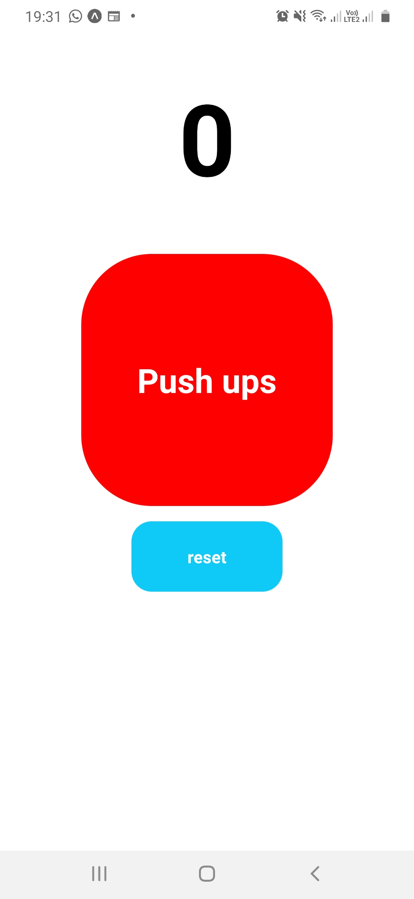

# Push Ups Android App

This project has as objective to apply knowledge of redux in Android app

# Used Technologies

- Expo
- Redux
- React-Native
- React-Redux

## First steps

Run this code initialize the app

1. > $ npm install
2. > $ expo start

## app image

